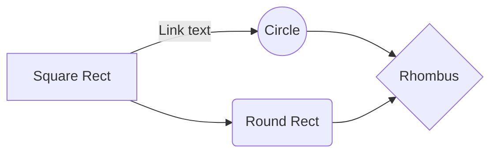

Env vars that change dynamically
<!-- NOTE-swimm-snippet: the lines below link your snippet to Swimm -->
### 📄 docker-compose.yml
```yaml
14         environment:
15         # TODO: (mrj) test stepsize issue
16           # Change this later.
17           - MARIADB_USER_NAME=mike
18           - MARIADB_USER_PASSWORD=mike
19         # TODO: (mrj) test stepsize issue 2
20         networks:
21           - dev
22         healthcheck:
23           test: "/usr/bin/mysql --user=$$MARIA_DB_USER_NAME --password=$$MARIADB_USER_PASSWORD --execute \"use users\""
24           timeout: 60s
25           retries: 60
```

<br/>

<!--MERMAID {width:100}-->

<!--MCONTENT {content: "graph LR<br/>\nA\\[Square Rect\\] -- Link text \\-\\-\\> B((Circle))<br/>\nA \\-\\-\\> C(Round Rect)<br/>\nB \\-\\-\\> D{Rhombus}<br/>\nC \\-\\-\\> D"} --->

<br/>

[[sym-mention:(cd0aadeb-39ab-4e46-8936-147ad8a95491|Z1F6g84)Mike Johnson]] test

```bash
code block test
test
test
```

<br/>


<!-- NOTE-swimm-snippet: the lines below link your snippet to Swimm -->
### 📄 testing/bills/main.go
```go
30     func promptOptions(b bill) {
31
32     	reader := bufio.NewReader(os.Stdin)
33     	fmt.Println("Options:")
34     	fmt.Println("1. Add item")
35     	fmt.Println("2. Update tip")
36     	fmt.Println("3. Format bill")
37     	fmt.Println("4. Exit")
38     	fmt.Println("Enter your choice: ")
39     	input, _ := getInput("", reader)
40     	switch input {
41     	case "1":
42     		addItem(b)
43     	case "2":
44     		updateTip(b)
45     	case "3":
46     		fmt.Println(b.format())
47     	case "4":
48     		os.Exit(0)
49     	default:
50     		fmt.Println("Invalid choice")
51     		promptOptions(b)
52     	}
53
54     	fmt.Println(reader)
```

<br/>

This file was generated by Swimm. [Click here to view it in the app](https://app.swimm.io/repos/Z2l0aHViJTNBJTNBZ211ZCUzQSUzQW1pa2Vqazhz/docs/z84ig317).
